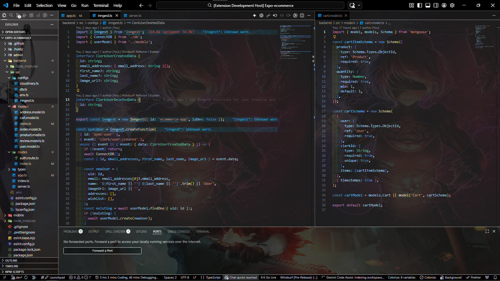

# Super Dark Theme

A minimal and high-contrast dark theme for Visual Studio Code, focused on clarity, consistency, and a distraction-free coding experience.

---

## Overview

Super Dark Theme is designed with a strict dark palette and carefully balanced contrast. It provides a clean interface across all major areas of the editor, including the sidebar, terminal, and settings UI.

---

## Preview

---

## Features

- Deep dark interface with minimal visual noise  
- High contrast for improved readability  
- Consistent styling across UI components  
- Clean terminal and panel integration  
- Subtle focus and selection states  
- Balanced use of accent colors  

---

## Installation

### From VSIX

1. Open Extensions in Visual Studio Code  
2. Open the menu (top right)  
3. Select **Install from VSIX**  
4. Choose the `.vsix` file  

---

## Usage

Open the Command Palette: 
Ctrl + Shift + P

Then select: 
Preferences: Color Theme

Choose: 
Super Dark Theme

---

## Customization

This theme is designed to be easily adjustable. You can override colors in your own settings if needed.

---

## Versioning

This project follows semantic versioning:

- Patch releases for small fixes  
- Minor releases for improvements  
- Major releases for significant design changes  

---

## License

This project is licensed under the MIT License. See the LICENSE file for details.

---

## Author

**Kirito**  
Creator of **Super Dark Theme**, a high-contrast, minimal VS Code theme designed to improve focus, readability, and productivity for developers.  
 

